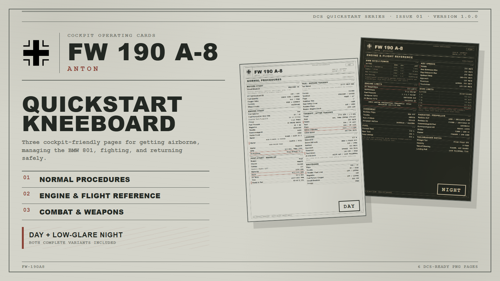
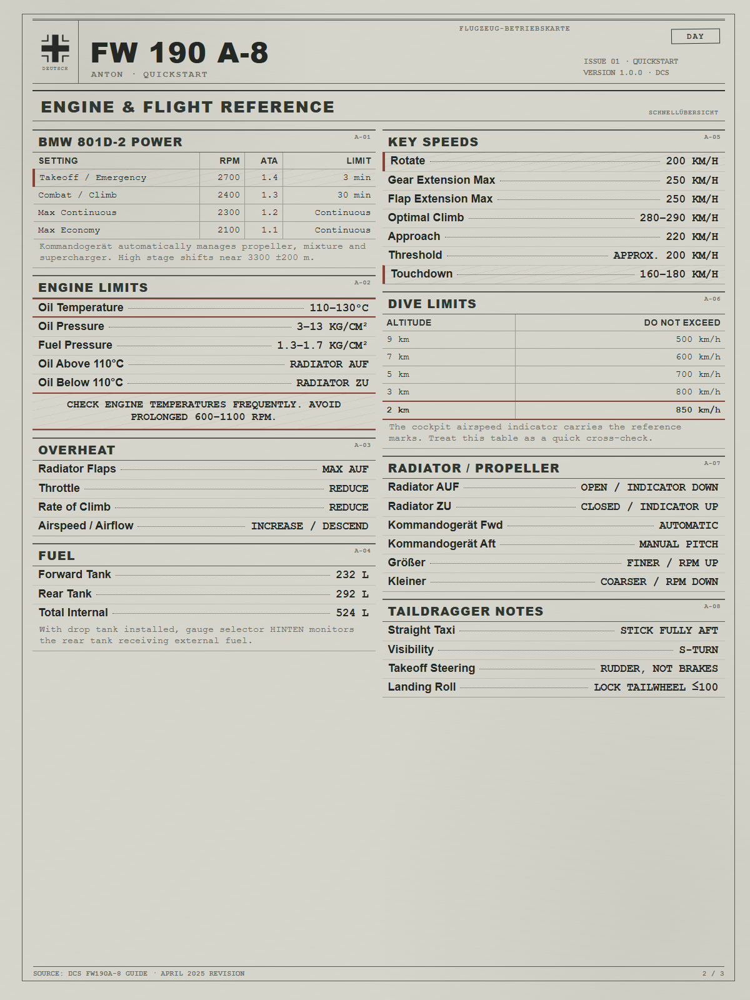
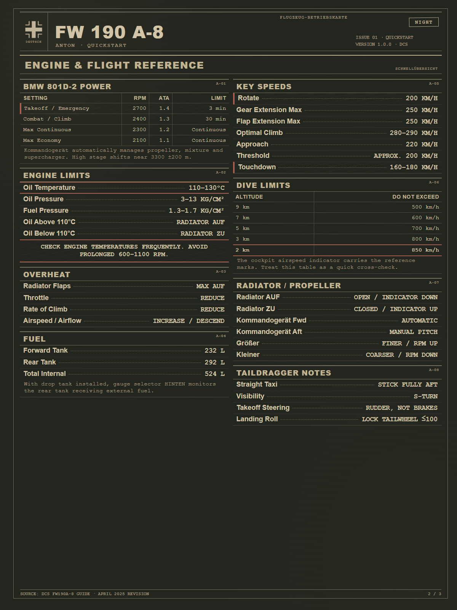

# Fw 190 A-8 Anton Canonical Example

This is the first complete worked example for the Kneeboard Design System.
It demonstrates how aircraft content, page formats, a document archetype,
an aircraft treatment, and lighting variants compose into a publishable pack.



## Artifact statement

> An issued Luftwaffe cockpit operating card derived from a technical field form.

```text
normal-checklist / engine-management / weapons-employment
                          +
                technical-field-form
                          +
                   luftwaffe-ww2
                          +
             paper-day / low-glare-night
                          =
         Fw 190 A-8 Anton quickstart kneeboard
```

The identity comes primarily from the physical-document logic: compact issue
docket, open ruled sections, typed working values, restrained inspection marks,
and cool field-grey stock. The origin mark and German cockpit labels are a
treatment layered onto that artifact rather than the basis of the design.

## Pack contents

The public pack contains matching day and night versions of three pages:

1. Normal Procedures
2. Engine & Flight Reference
3. Combat & Weapons

See [`page-plan.md`](page-plan.md) for the scan purpose, section plan, and
scope decisions for each page. See [`pack.yaml`](pack.yaml) for the release
metadata.

## Source layout

```text
source/
  kneeboard.css
  assets/
    balkenkreuz.svg
  day/
    ...three HTML pages
  night/
    ...three HTML pages
previews/
  cover.png
  day-engine-reference.png
  night-engine-reference.png
```

The HTML files are intentionally static and explicit so authors can inspect
the semantic class usage without first learning a build tool. Open any HTML
file in a browser at a `1200 x 1600` viewport to reproduce its kneeboard page.

## Representative pages

### Day



### Low-glare night



## What is excluded

- Source manuals and extracted guide text
- The user-supplied original checklist
- Installation archives
- The complete set of generated PNGs

Generated release artifacts remain in ignored `output/` and are distributed
through DCS User Files or release hosting.

## Licensing

The reusable design-system code and documentation remain under the repository's
[MIT License](../../LICENSE).

The aircraft-specific kneeboard wording, arrangement, and rendered artwork in
this example are licensed under
[CC BY-NC-SA 4.0](https://creativecommons.org/licenses/by-nc-sa/4.0/).
Third-party names, aircraft designations, and marks are excluded from that
license and remain the property of their respective owners.

## Status

Public pack version: `1.0.0`

DCS Quickstart Series: `Issue 01`

The DCS User Files submission is awaiting moderation. Feedback from that
release will inform later revisions rather than changing this `1.0.0` example.
